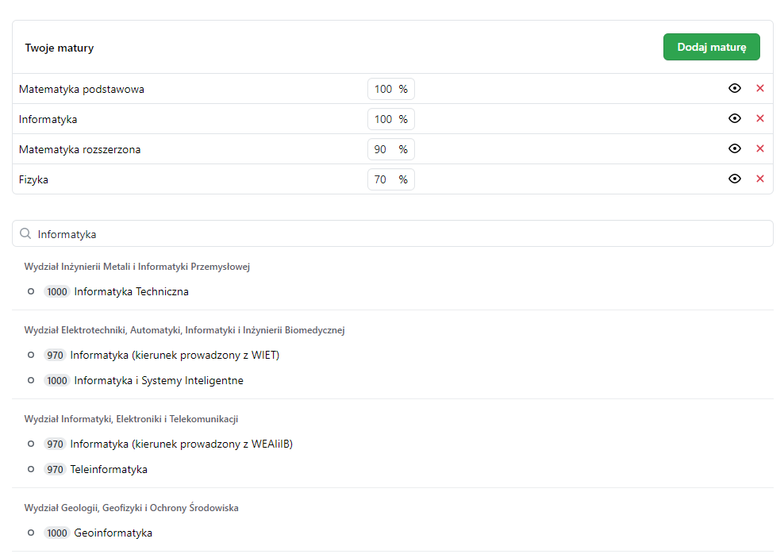

<br />
<p align="center">

  <h3 align="center">AGH Calculator</h3>

  <p align="center">
    A simple and easy to use calculator for students applying to AGH UST
    <br />
    <a href="https://calc.deithy.me/" target="_blank"><strong>View live »</strong></a>
    <br />
    <br />
    <a href="https://github.com/deithy/recruitment-calculator/issues">Report bug</a>
    ·
    <a href="https://github.com/deithy/recruitment-calculator/issues">Request Feature</a>
  </p>
</p>

<!-- TABLE OF CONTENTS -->
<details>
  <summary>Table of Contents</summary>
  <ol>
    <li>
      <a href="#about-the-project">About The Project</a>
      <ul>
        <li><a href="#built-with">Built With</a></li>
      </ul>
    </li>
    <li>
      <a href="#getting-started">Getting Started</a>
      <ul>
        <li><a href="#prerequisites">Prerequisites</a></li>
        <li><a href="#installation">Installation</a></li>
      </ul>
    </li>
    <li><a href="#license">License</a></li>
    <li><a href="#contact">Contact</a></li>
    <li><a href="#acknowledgements">Acknowledgements</a></li>
  </ol>
</details>

## About The Project

[](https://calc.deithy.me/)

The algorithm for calculating recruitments points can be confusing and has some grey areas that are not
well documented, not to mention that one can only see his score after selecting the study field. This
project aims to fix that issue by allowing future students to fill their scores globally and see
all the scores before selecting study fields.

### Built With

Major tools used are listed below, to see the full list go to acknowledgements.

- [React](https://reactjs.org/)
- [Primer](https://primer.style/)
- [Redux toolkit](https://redux-toolkit.js.org/)

## Getting Started

If you would like to see how the project works you may want to install it on your machine.

To get a local copy up and running follow steps below.

### Prerequisites

Node and npm are required to install and run the project.

### Installation

1. Clone the repo
   ```sh
   git clone https://github.com/deithy/recruitment-calculator.git
   ```
2. Install NPM packages
   ```sh
   npm install
   ```
3. Run in browser
   ```sh
   npm start
   ```

## License

Distributed under the MIT License. See `LICENSE` for more information.

## Contact

Arnold Kokot - [@deithyy](https://twitter.com/deithyy) - ogkokot@gmail.com

Project Link: [https://github.com/deithy/recruitment-calculator](https://github.com/deithy/recruitment-calculator)

## Acknowledgements

- [Create react app](https://create-react-app.dev/)
- [React](https://reactjs.org/)
- [Normalize.css](https://shields.io)
- [Primer](https://primer.style/)
- [Redux toolkit](https://redux-toolkit.js.org/)
